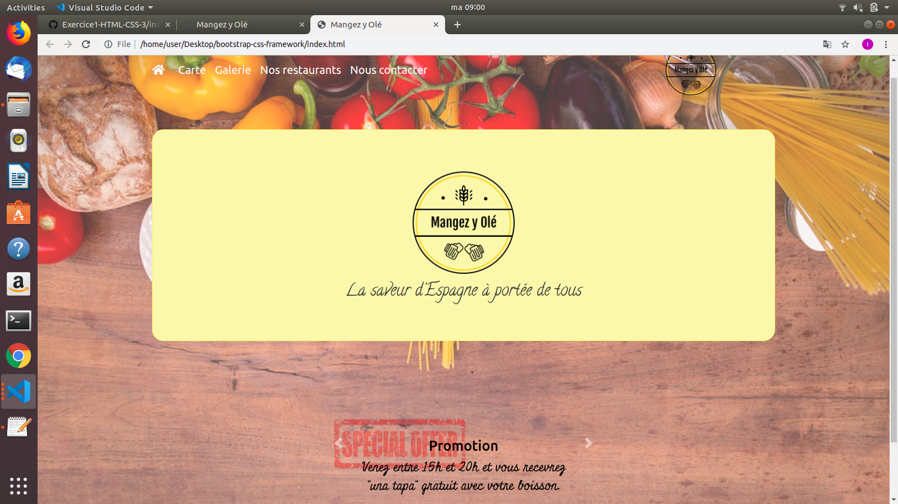

# bootstrap-css-framework

This project is a restaurant Bootstrap project made in two weeks. 

**A quoi ça ressemble ?** [Démo](https://isabelaguera.github.io/restaurant-site-bootstrap/.)

## Built with
This site is built with HTML, CSS, Bootstrap.

## Autheurs

* **Isabel Aguera Calvo**- [IsabelAguera](https://github.com/IsabelAguera)

    * **https://www.linkedin.com/in/isabel-aguera/** : [Isabel Aguera]

